<!--
  ╔══════════════════════════════════════════════════════════════════════════╗
  ║  アーカーシュ・ウィジェセカラ — GitHub profile                             ║
  ║  Every ./assets/... image must be uploaded to this repo next to README.md ║
  ║  (assets/*.svg and assets/headers/*.svg), or it shows as a broken image.   ║
  ╚══════════════════════════════════════════════════════════════════════════╝
-->

<!-- 第一話 · HERO -->
<div align="center">
  
</div>

<div align="center">
  
</div>

<div align="center">
  
  
  <a href="https://wso2.com"></a>
  <a href="https://linkedin.com/in/aakash-wijesekara-611588318"></a>
  <a href="https://aakashwije.github.io/AAKASHWIJE_PORFOLIO/"></a>
</div>


<!-- 壱 · 状態 PLAYER STATUS -->

<div align="center">
  
</div>

<!-- 弐 · 依頼書 QUEST BOARD -->

<div align="center">
  
</div>

<!-- 参 · 物語 STORY ARCS -->

<div align="center">
  
</div>

<!-- 肆 · 武器庫 WEAPON ARSENAL -->

<div align="center">
<table>
  <tr>
    <td align="center" width="190"><b>主武器</b><br/><sub>MAIN WEAPONS · Backend</sub></td>
    <td align="center">
      <br/>
      
    </td>
  </tr>
  <tr>
    <td align="center"><b>魔導書</b><br/><sub>SPELLBOOKS · APIs &amp; Integration</sub></td>
    <td align="center"></td>
  </tr>
  <tr>
    <td align="center"><b>式神</b><br/><sub>SHIKIGAMI · Frontend &amp; Mobile</sub></td>
    <td align="center"></td>
  </tr>
  <tr>
    <td align="center"><b>蔵</b><br/><sub>STOREHOUSE · Databases</sub></td>
    <td align="center"></td>
  </tr>
  <tr>
    <td align="center"><b>天空</b><br/><sub>SKY REALM · Cloud &amp; DevOps</sub></td>
    <td align="center"></td>
  </tr>
</table>
</div>

<!-- 伍 · 日課 DAILY QUEST -->

<div align="center">
  
</div>

<!-- 陸 · 忍道 MY NINJA WAY -->

```ts
// 忍道 (nindō) — 俺の忍道: the ninja way of shipping software
const nindo = {
  naruto:  "まっすぐ自分の言葉は曲げねぇ — an API contract is a promise.",
  luffy:   "ギア5 → horizontal autoscaling unlocked.",
  gojo:    "領域展開 — Domain Expansion: Infinite Microservices.",
  levi:    "掃除だ — clean code only. Tech debt gets cut down on sight.",
  saitama: "一撃 — one commit, one punch, bug gone.",
  jinwoo:  "起きろ (ARISE) — every crashed pod comes back stronger.",
  senku:   "百億パーセント — ten billion percent sure? Write the test first.",
} as const;
```

<!-- 漆 · 戦闘力 POWER LEVEL -->

<p align="center"><b>スカウター測定中…… 戦闘力、9000 以上！</b><br/><sub>scouter reading in progress — it's over 9000 (eventually)</sub></p>

<div align="center">
  
</div>

<br/>

<div align="center">
  
  
</div>

<!-- 捌 · 称号 TITLES UNLOCKED -->

<div align="center">
  
</div>

<!-- 玖 · 御神籤 OMIKUJI -->

<div align="center">
  
</div>

<!-- 拾 · 草 THE GRASS EATER -->

<p align="center"><b>日本ではコントリビューショングラフを「草」と呼ぶ。この蛇はそれを食べる。</b><br/><sub>in Japan the contribution graph is called 草 (kusa, "grass") — this snake eats it</sub></p>

<div align="center">
  <picture>
    <source media="(prefers-color-scheme: dark)" srcset="https://raw.githubusercontent.com/aakashwije/aakashwije/output/github-snake-dark.svg"/>
    <source media="(prefers-color-scheme: light)" srcset="https://raw.githubusercontent.com/aakashwije/aakashwije/output/github-snake.svg"/>
    
  </picture>
</div>

<!-- 拾壱 · 縁 LET'S CONNECT -->

<div align="center">
  <a href="https://linkedin.com/in/aakash-wijesekara-611588318"></a>
  <a href="mailto:aakashwije92@gmail.com"></a>
  <a href="https://aakashwije.github.io/AAKASHWIJE_PORFOLIO/"></a>
  <a href="https://instagram.com/aakashh_.04"></a>
  <a href="https://www.hackerrank.com/@aakash_20240843"></a>
  <a href="https://fb.com/aakash wijesekara"></a>
</div>

<p align="center"><b>いつでも気軽に声をかけてね。</b><br/><sub>always up for collaborations, open-source quests &amp; epic backend problems — reach out anytime</sub></p>

<!-- つづく · FOOTER -->
<div align="center">
  
</div>
